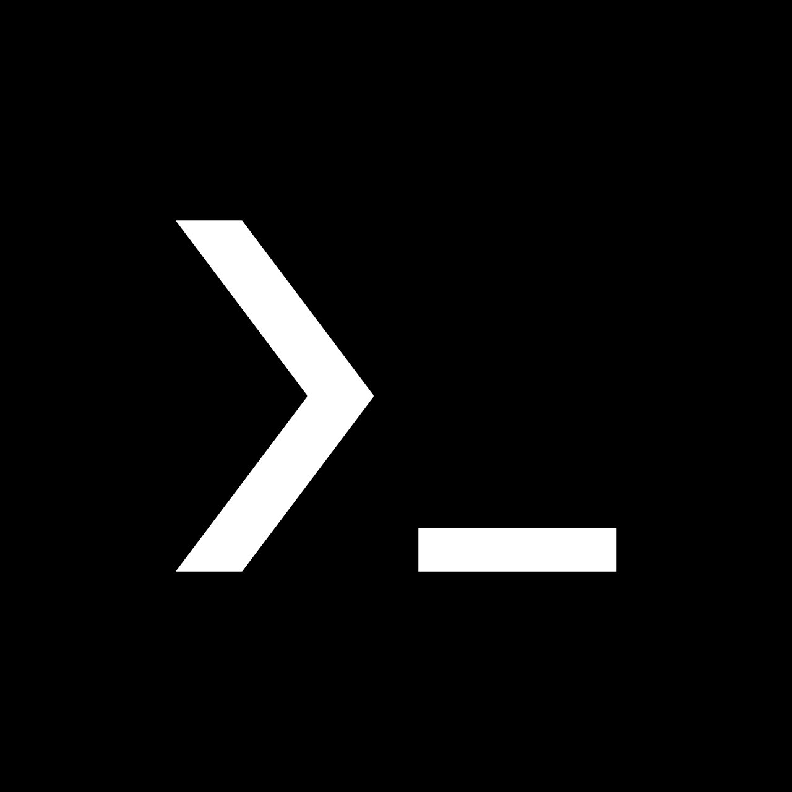
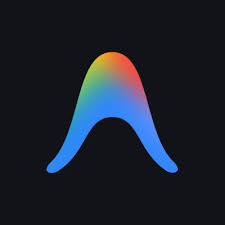

<div align="center">



# `whoami` → Jaival Soni

[](https://github.com/JaivalSoni)

[](https://github.com/JaivalSoni)
[](https://github.com/JaivalSoni)

</div>

---

## `$ cat about.txt`

```
B.Tech CSE student — building skills that actually matter beyond the curriculum.
Location   :  Gandhinagar, India
Interests  :  AI/ML  |  Cybersecurity  |  Web Development
Mindset    :  Understand the system before you trust it.
```

---

## `$ ls skills/`

**Languages**


**Data & ML**


**Tech Stack**

[](https://skillicons.dev)

**Tools**




## `$ cat /etc/os-release` — Linux Experience

> I work primarily on Linux across security research and daily use. Honest breakdown below.

**Active / Primary**

| Distro | Role | Status |
|--------|------|--------|
|  | Offensive Security — network scanning, enumeration, exploitation | Active · multiple hands-on attacks |
|  | Defensive Security — OSINT, forensics, privacy-focused tooling | Comfortable with the ecosystem |
|  | System internals — manual setup, package management, customization | Currently learning |

**Explored**


---

## `$ tail -f learning.log`

```bash
[ACTIVE]   Machine Learning      →  Algorithms, model training, evaluation
[ACTIVE]   Deep Learning         →  CNNs, RNNs, Transformers
[ACTIVE]   Cybersecurity         →  Offensive & defensive techniques, protocols
[ACTIVE]   Arch Linux            →  Because understanding the system matters
[ACTIVE]   DSA                   →  Problem solving in C++
```

## `$ cat goals.txt`
```bash
[ ] Contribute to an open-source ML project  →  TensorFlow / Hugging Face / Scikit-learn
[ ] Build & deploy a real AI/ML project end-to-end
[ ] Land Google Summer of Code (GSoC)
```

---

## `$ neofetch --stats`

<div align="center">


</div>

---

<div align="center">

```
> Consistency > Motivation. Keep building.
```

</div>
